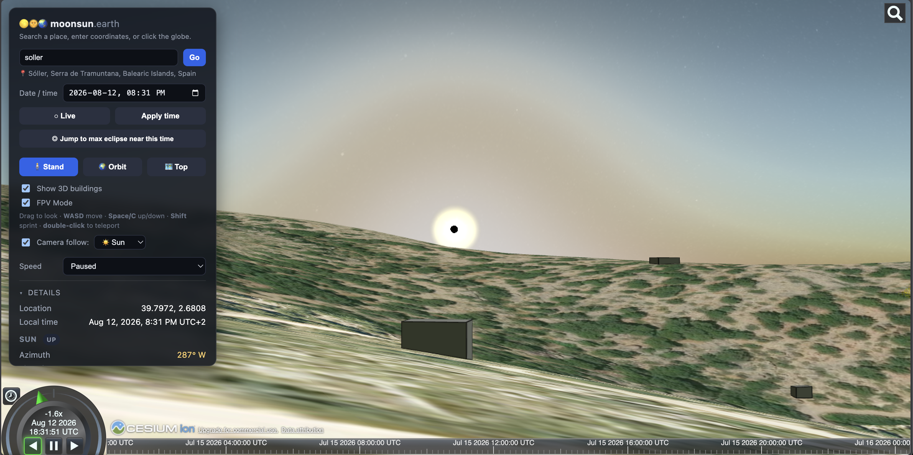

# 🌗🌞🌏 moonsun.earth

**Stand anywhere on Earth and see exactly where the Sun and Moon will be in the sky — for any date and time.** Built to be the most realistic way to scout a spot for a solar eclipse.

👉 **[moonsun.earth](https://moonsun.earth)**

## What it does

Pick a place — by name, address, or coordinates — choose a moment in time, and drop down to eye level to look at the real sky:

- 🌍 **Real 3D Earth** with satellite imagery, terrain, and buildings.
- ☀️🌙 **Accurate Sun & Moon** positions for your exact spot and time.
- 🌑 **Eclipse preview** — watch the Moon slide over the Sun, the sky darken, and totality happen right where you're standing.
- 🎯 **Jump to max eclipse** — instantly find the moment of deepest coverage at your location.
- ☁️ **Weather realism** — add clouds, haze, and visibility, or pull real forecasts and 10-year climate averages to judge your odds of a clear view.
- 🧍 **First-person mode** — walk around, look up, and see the eclipse as you actually would.

## How to use it

1. **Search** for a location (or click the globe).
2. Set a **date & time**, or hit **Live**.
3. Click **Stand** to drop to the ground and look up.
4. Press **Jump to max eclipse** to leap to the big moment.
5. Open **Weather** to preview cloud cover and see if you'll get a clear sky.

## Credits

Built with [CesiumJS](https://cesium.com), [SunCalc](https://github.com/mourner/suncalc),
and open data from [Open-Meteo](https://open-meteo.com) and [OpenStreetMap](https://www.openstreetmap.org).
